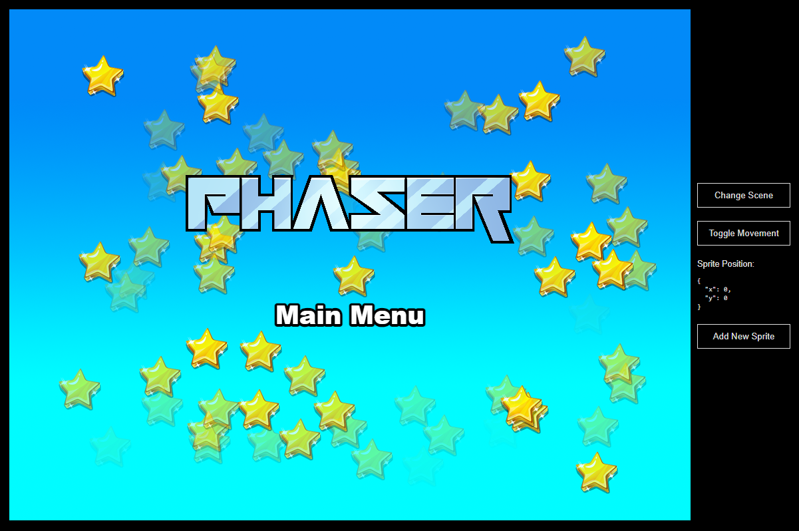

# Phaser React Template

This is a Phaser 3 project template that uses the React framework and Vite for bundling. It includes a bridge for React to Phaser game communication, hot-reloading for quick development workflow and scripts to generate production-ready builds.

**[This Template is also available as a TypeScript version.](https://github.com/phaserjs/template-react-ts)**

### Versions

This template has been updated for:

- [Phaser 3.87.0](https://github.com/phaserjs/phaser)
- [React 18.3.1](https://github.com/facebook/react)
- [Vite 5.3.1](https://github.com/vitejs/vite)



## Requirements

[Node.js](https://nodejs.org) is required to install dependencies and run scripts via `npm`.

## Available Commands

| Command | Description |
|---------|-------------|
| `npm install` | Install project dependencies |
| `npm run dev` | Launch a development web server |
| `npm run build` | Create a production build in the `dist` folder |
| `npm run dev-nolog` | Launch a development web server without sending anonymous data (see "About log.js" below) |
| `npm run build-nolog` | Create a production build in the `dist` folder without sending anonymous data (see "About log.js" below) |

## Writing Code

After cloning the repo, run `npm install` from your project directory. Then, you can start the local development server by running `npm run dev`.

The local development server runs on `http://localhost:8080` by default. Please see the Vite documentation if you wish to change this, or add SSL support.

Once the server is running you can edit any of the files in the `src` folder. Vite will automatically recompile your code and then reload the browser.

## Template Project Structure

We have provided a default project structure to get you started. This is as follows:

- `index.html` - A basic HTML page to contain the game.
- `src` - Contains the React client source code.
- `src/main.jsx` - The main **React** entry point. This bootstraps the React application.
- `src/App.jsx` - The main React component.
- `src/game/PhaserGame.jsx` - The React component that initializes the Phaser Game and serve like a bridge between React and Phaser.
- `src/game/EventBus.js` - A simple event bus to communicate between React and Phaser.
- `src/game` - Contains the game source code.
- `src/game/main.jsx` - The main **game** entry point. This contains the game configuration and start the game.
- `src/game/scenes/` - The Phaser Scenes are in this folder.
- `public/style.css` - Some simple CSS rules to help with page layout.
- `public/assets` - Contains the static assets used by the game.

## React Bridge

The `PhaserGame.jsx` component is the bridge between React and Phaser. It initializes the Phaser game and passes events between the two.

To communicate between React and Phaser, you can use the **EventBus.js** file. This is a simple event bus that allows you to emit and listen for events from both React and Phaser.

```js
// In React
import { EventBus } from './EventBus';

// Emit an event
EventBus.emit('event-name', data);

// In Phaser
// Listen for an event
EventBus.on('event-name', (data) => {
    // Do something with the data
});
```

In addition to this, the `PhaserGame` component exposes the Phaser game instance along with the most recently active Phaser Scene using React forwardRef.

Once exposed, you can access them like any regular react reference.

## Phaser Scene Handling

In Phaser, the Scene is the lifeblood of your game. It is where you sprites, game logic and all of the Phaser systems live. You can also have multiple scenes running at the same time. This template provides a way to obtain the current active scene from React.

You can get the current Phaser Scene from the component event `"current-active-scene"`. In order to do this, you need to emit the event `"current-scene-ready"` from the Phaser Scene class. This event should be emitted when the scene is ready to be used. You can see this done in all of the Scenes in our template.

**Important**: When you add a new Scene to your game, make sure you expose to React by emitting the `"current-scene-ready"` event via the `EventBus`, like this:


```js
class MyScene extends Phaser.Scene
{
    constructor ()
    {
        super('MyScene');
    }

    create ()
    {
        // Your Game Objects and logic here

        // At the end of create method:
        EventBus.emit('current-scene-ready', this);
    }
}
```

You don't have to emit this event if you don't need to access the specific scene from React. Also, you don't have to emit it at the end of `create`, you can emit it at any point. For example, should your Scene be waiting for a network request or API call to complete, it could emit the event once that data is ready.

### React Component Example

Here's an example of how to access Phaser data for use in a React Component:

```js
import { useRef } from 'react';

// In a parent component
const ReactComponent = () => {

    const phaserRef = useRef(); // you can access to this ref from phaserRef.current

    const onCurrentActiveScene = (scene) => {
    
        // This is invoked

    }

    return (
        ...
        <PhaserGame ref={phaserRef} currentActiveScene={onCurrentActiveScene} />
        ...
    );

}
```

In the code above, you can get a reference to the current Phaser Game instance and the current Scene by creating a reference with `useRef()` and assign to PhaserGame component.

From this state reference, the game instance is available via `phaserRef.current.game` and the most recently active Scene via `phaserRef.current.scene`.

The `onCurrentActiveScene` callback will also be invoked whenever the the Phaser Scene changes, as long as you emit the event via the EventBus, as outlined above.

## Handling Assets

Vite supports loading assets via JavaScript module `import` statements.

This template provides support for both embedding assets and also loading them from a static folder. To embed an asset, you can import it at the top of the JavaScript file you are using it in:

```js
import logoImg from './assets/logo.png'
```

To load static files such as audio files, videos, etc place them into the `public/assets` folder. Then you can use this path in the Loader calls within Phaser:

```js
preload ()
{
    //  This is an example of an imported bundled image.
    //  Remember to import it at the top of this file
    this.load.image('logo', logoImg);

    //  This is an example of loading a static image
    //  from the public/assets folder:
    this.load.image('background', 'assets/bg.png');
}
```

When you issue the `npm run build` command, all static assets are automatically copied to the `dist/assets` folder.

## Deploying to Production

After you run the `npm run build` command, your code will be built into a single bundle and saved to the `dist` folder, along with any other assets your project imported, or stored in the public assets folder.

In order to deploy your game, you will need to upload *all* of the contents of the `dist` folder to a public facing web server.

## Customizing the Template

### Vite

If you want to customize your build, such as adding plugin (i.e. for loading CSS or fonts), you can modify the `vite/config.*.mjs` file for cross-project changes, or you can modify and/or create new configuration files and target them in specific npm tasks inside of `package.json`. Please see the [Vite documentation](https://vitejs.dev/) for more information.

## About log.js

If you inspect our node scripts you will see there is a file called `log.js`. This file makes a single silent API call to a domain called `gryzor.co`. This domain is owned by Phaser Studio Inc. The domain name is a homage to one of our favorite retro games.

We send the following 3 pieces of data to this API: The name of the template being used (vue, react, etc). If the build was 'dev' or 'prod' and finally the version of Phaser being used.

At no point is any personal data collected or sent. We don't know about your project files, device, browser or anything else. Feel free to inspect the `log.js` file to confirm this.

Why do we do this? Because being open source means we have no visible metrics about which of our templates are being used. We work hard to maintain a large and diverse set of templates for Phaser developers and this is our small anonymous way to determine if that work is actually paying off, or not. In short, it helps us ensure we're building the tools for you.

However, if you don't want to send any data, you can use these commands instead:

Dev:

```bash
npm run dev-nolog
```

Build:

```bash
npm run build-nolog
```

Or, to disable the log entirely, simply delete the file `log.js` and remove the call to it in the `scripts` section of `package.json`:

Before:

```json
"scripts": {
    "dev": "node log.js dev & dev-template-script",
    "build": "node log.js build & build-template-script"
},
```

After:

```json
"scripts": {
    "dev": "dev-template-script",
    "build": "build-template-script"
},
```

Either of these will stop `log.js` from running. If you do decide to do this, please could you at least join our Discord and tell us which template you're using! Or send us a quick email. Either will be super-helpful, thank you.

## Join the Phaser Community!

We love to see what developers like you create with Phaser! It really motivates us to keep improving. So please join our community and show-off your work 😄

**Visit:** The [Phaser website](https://phaser.io) and follow on [Phaser Twitter](https://twitter.com/phaser_)<br />
**Play:** Some of the amazing games [#madewithphaser](https://twitter.com/search?q=%23madewithphaser&src=typed_query&f=live)<br />
**Learn:** [API Docs](https://newdocs.phaser.io), [Support Forum](https://phaser.discourse.group/) and [StackOverflow](https://stackoverflow.com/questions/tagged/phaser-framework)<br />
**Discord:** Join us on [Discord](https://discord.gg/phaser)<br />
**Code:** 2000+ [Examples](https://labs.phaser.io)<br />
**Read:** The [Phaser World](https://phaser.io/community/newsletter) Newsletter<br />

Created by [Phaser Studio](mailto:support@phaser.io). Powered by coffee, anime, pixels and love.

The Phaser logo and characters are &copy; 2011 - 2024 Phaser Studio Inc.

All rights reserved.
